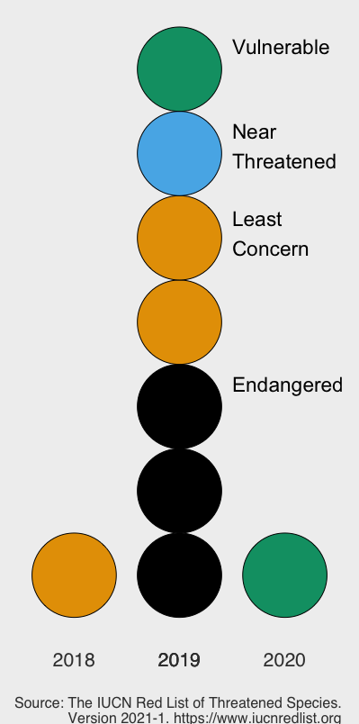

# Threatened Species

 Goal: Design using feature channels. Context: Visualization for a Powerpoint presentation to a TED-talk-like audience of environmentally concerned people.

Produced in R and Adobe Illustrator, as a graduate assignment.

The graphs in the R file were exported and adapted in Illustrator to produce something like this image.

You can see the pdf made from this at output/KathrynHurchla_ThreatenedSpecies-1_2021-07-20.pdf 

Demonstrates an understanding of audience cognitive/perceptual focus through the use of feature channels, including: 
*color to represent the IUCN Red List Threatened Species category, 
*shape to represent the habitat system of each species, and 
*a time axis to show the assessment years. 

Other design principles used include:
*visual hierarchy in text through the headings to organize the page, and 
*slightly overlapping shapes to allow the Least Concern to recede into the background dimensionally somewhat. 

Further development ideas include:
*minimal animation to draw attention immediately and raise the audience's alarm to the two species that are listed with a Declining population trend among this group, and
*size could be incorporated to represent the frequency of presence with each species that was recorded.

